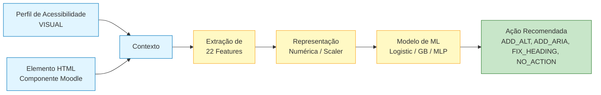
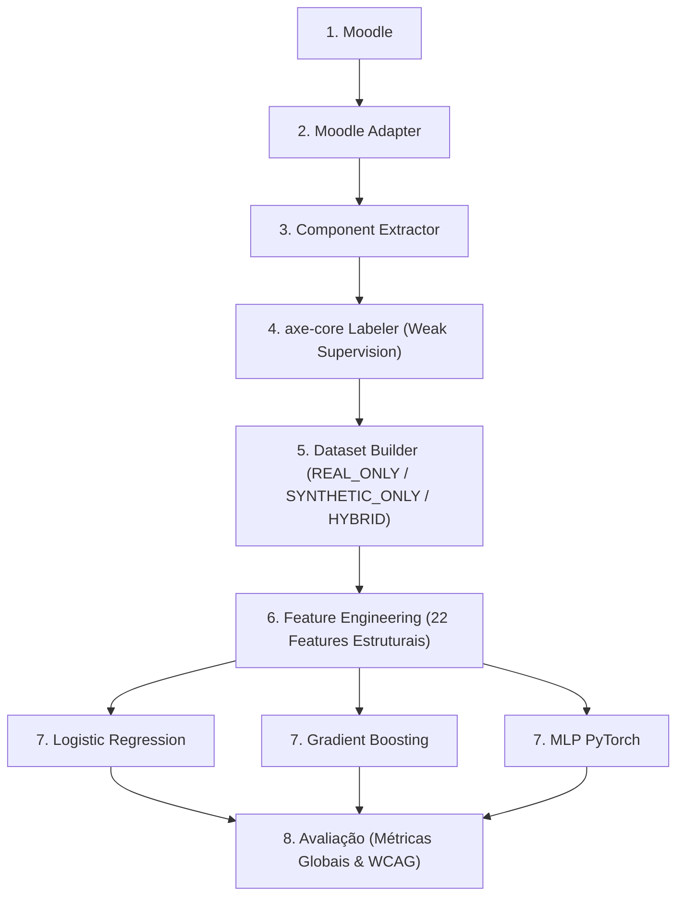
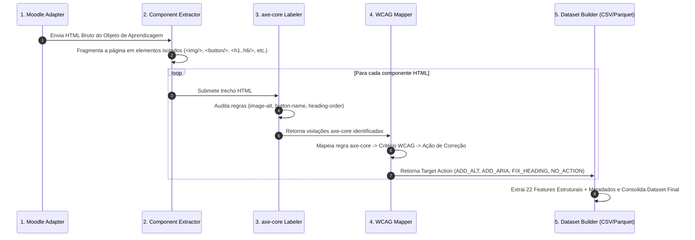

# Detecção Automática de Barreiras de Acessibilidade em Objetos de Aprendizagem Utilizando Deep Learning e Weak Supervision

> **Projeto Acadêmico de Mestrado e Disciplina de Deep Learning**
> Investigação experimental sobre recomendação automática de adaptações de acessibilidade em componentes HTML de Objetos de Aprendizagem (OAs) utilizados no Moodle através de aprendizado de máquina supervisionado e *Weak Supervision* com **axe-core**.

[](LICENSE)
[](https://www.python.org/downloads/)
[](https://github.com/psf/black)

---

## 1. Introdução

A acessibilidade digital é um requisito essencial em Ambientes Virtuais de Aprendizagem (AVA) como o Moodle, pois garante o acesso equânime ao conhecimento para pessoas com deficiência. Este repositório contém o **laboratório computacional completo** para a pesquisa intitulada *"Detecção Automática de Barreiras de Acessibilidade em Objetos de Aprendizagem Utilizando Deep Learning"*.

O projeto é um artefato **experimental de validação de hipótese** — não implementa o sistema de adaptação dinâmica do Moodle em produção. O objetivo é verificar se modelos supervisionados (Regressão Logística, Gradient Boosting e MLP em PyTorch) são capazes de **recomendar** adaptações de acessibilidade em componentes HTML de OAs a partir de um **perfil de acessibilidade do usuário** e de um **elemento HTML**, utilizando dados reais do Moodle e *Weak Supervision* com o motor de auditoria **axe-core**.

---

## 2. Objetivo Científico

Investigar empiricamente se um modelo de aprendizado supervisionado (Regressão Logística, Gradient Boosting e MLP em PyTorch) consegue inferir qual **ação de acessibilidade** deve ser recomendada (`ADD_ALT`, `ADD_ARIA`, `FIX_HEADING`, `NO_ACTION`) dado um par *(perfil do usuário, elemento HTML)*.

---

## 3. Motivação

* **Crescimento do Ensino a Distância (EAD):** Expansão contínua de cursos mediados por Objetos de Aprendizagem (OAs) no Moodle.
* **Processo Manual e Reativo:** A acessibilidade em OAs ainda é frequentemente tratada de forma reativa, dependendo de auditorias manuais demoradas.
* **Dificuldade na Identificação de Barreiras:** Professores e designers instrucionais encontram dificuldades técnicas para identificar falhas estruturais em componentes HTML.
* **Potencial de Recomendação Automática:** Uso de modelos preditivos baseados em dados para recomendar ações corretivas determinísticas com base nas diretrizes **WCAG 2.1**.

---

## 4. Questão de Pesquisa

> É possível treinar um modelo supervisionado para recomendar adaptações de acessibilidade em elementos HTML de Objetos de Aprendizagem do Moodle, considerando diferentes perfis de usuários?

---

## 5. Hipótese

> **H₁:** Dado um perfil de acessibilidade e um elemento HTML de um Objeto de Aprendizagem, um modelo supervisionado é capaz de predizer com acurácia significativamente superior ao acaso qual adaptação de acessibilidade deve ser aplicada.
>
> **H₀:** O modelo não apresenta desempenho superior ao classificador base (*majority class baseline*).

---

## 6. Arquitetura Conceitual e Pipeline em 8 Camadas

### 6.1. Modelo Conceitual (Entrada → Saída)



### 6.2. Arquitetura em 8 Camadas do Pipeline



---

## 7. Responsabilidades das 8 Camadas

1. **Moodle:** Fonte dos Objetos de Aprendizagem (OAs). Contém cursos, páginas, atividades e recursos.
2. **Moodle Adapter (`src/moodle/adapter.py`):** Autentica na plataforma Moodle, navega por conteúdos, extrai o HTML completo de páginas/atividades e gera metadados de origem (`course_id`, `activity_id`, `url`, `timestamp`). Suporta modos `DIRECT_URL`, `REST_API` e `FALLBACK`.
3. **Component Extractor (`src/extractor/component_extractor.py`):** Fragmenta automaticamente a página HTML em componentes independentes (`img`, `button`, `input`, `form`, `table`, `a`, `select`, `textarea`, `video`, `audio`, `figure`, `svg`, `canvas`).
4. **axe-core Labeler (`src/labeler/axe_labeler.py`):** Executa o motor axe-core via Playwright / analisador de regras axe-core, analisa cada componente HTML individualmente, gera um JSON de violações, converte-as em critérios WCAG (`WCAGMapper`) e rotula os componentes (*Weak Supervision*).
5. **Dataset Builder (`src/dataset/builder.py`):** Consolida dados nos modos `REAL_ONLY`, `SYNTHETIC_ONLY` ou `HYBRID` e exporta automaticamente em CSV (`accessibility_dataset.csv`) e Apache Parquet (`accessibility_dataset.parquet`).
6. **Feature Engineering (`src/dataset/feature_engineering.py`):** Extrai 22 features estruturais numéricas do DOM/HTML.
7. **Modelagem (`src/models/`):** Implementa e treina **Logistic Regression**, **Gradient Boosting** e **MLP (PyTorch)**.
8. **Avaliação (`src/evaluation/`):** Calcula Precision, Recall, F1-score globais e por critério WCAG (`wcag_evaluation.csv`), comparando os modelos entre si e contra as violações detectadas pelo axe-core.

---

## 8. Atuação do axe-core e Weak Supervision

O **axe-core** (motor de auditoria desenvolvido pela Deque Systems) atua na **Camada 4** como gerador de rótulos automáticos de *Supervisão Fraca (Weak Supervision)*. Ele substitui a anotação manual por especialistas humanos, garantindo auditabilidade determinística e conformidade com a diretriz internacional **WCAG 2.1**.

### Fluxo de Processamento e Rotulação Automática



### Mapeamento axe-core -> WCAG -> Ação Alvo

| Regra do axe-core | Critério WCAG Associado | Ação Alvo (*Target Action*) | Exemplo de Componente |
| :--- | :--- | :--- | :--- |
| `image-alt`, `area-alt` | **WCAG 1.1.1** (Conteúdo Não Textual) | **`ADD_ALT`** | `` |
| `button-name`, `label`, `select-name` | **WCAG 4.1.2** (Nome, Função, Valor) | **`ADD_ARIA`** | `<button class="btn"></button>` |
| `heading-order`, `empty-heading` | **WCAG 1.3.1** (Informações e Relações) | **`FIX_HEADING`** | `<h3>Título</h3>` *(Sem h1/h2 prévio)* |
| *(Nenhuma violação)* | Conforme WCAG 2.1 | **`NO_ACTION`** | `` |

---

## 9. Exemplo de Registro de Dados no Dataset (`accessibility_dataset.csv`)

O dataset final é composto por **33 colunas** contendo metadados de origem, 22 features estruturais numéricas extraídas e os rótulos gerados pelo axe-core:

| id | profile | html | component_type | source_type | action | wcag_violations | has_img | has_alt | has_aria | invalid_heading | tag_count |
|---|---|---|---|---|---|---|---|---|---|---|---|
| **1** | `VISUAL` | `` | `img` | `REAL_MOODLE` | **`ADD_ALT`** | `["WCAG_1_1_1"]` | 1 | 0 | 0 | 0 | 1 |
| **2** | `VISUAL` | `<button class="icon"></button>` | `button` | `REAL_MOODLE` | **`ADD_ARIA`** | `["WCAG_4_1_2"]` | 0 | 0 | 0 | 0 | 1 |
| **3** | `VISUAL` | `<h3>Seção de Conteúdo</h3>` | `h3` | `REAL_MOODLE` | **`FIX_HEADING`** | `["WCAG_1_3_1"]` | 0 | 0 | 0 | 1 | 1 |
| **4** | `VISUAL` | `` | `img` | `REAL_MOODLE` | **`NO_ACTION`** | `[]` | 1 | 1 | 0 | 0 | 1 |

> **Documentação Completa do Dataset:** Veja detalhes do schema em [`docs/dataset.md`](docs/dataset.md), na metodologia em [`docs/metodologia.md`](docs/metodologia.md) e na especificação do axe-core em [`docs/axe_core.md`](docs/axe_core.md).

---

## 10. Estrutura do Repositório

```
accessibility-dl-moodle/
├── README.md                  ← Este arquivo
├── LICENSE                    ← Licença MIT
├── requirements.txt
├── Makefile
│
├── docs/                      ← Documentação científica e técnica
│   ├── arquitetura.md
│   ├── metodologia.md
│   ├── axe_core.md
│   ├── reproduzibilidade.md
│   ├── dataset.md
│   └── metricas.md
│
├── dataset/                   ← Datasets gerados
│   ├── raw/
│   │   ├── accessibility_dataset.csv
│   │   └── accessibility_dataset.parquet
│   ├── processed/
│   │   ├── train.csv
│   │   ├── validation.csv
│   │   └── test.csv
│   └── synthetic/
│       └── dataset_generator.py
│
├── notebooks/                 ← Notebooks didáticos Jupyter
│   ├── 01_exploracao_dataset.ipynb
│   ├── 02_preprocessamento.ipynb
│   ├── 03_treinamento_regressao_logistica.ipynb
│   ├── 04_treinamento_mlp.ipynb
│   ├── 05_avaliacao_modelos.ipynb
│   └── 06_analise_erros.ipynb
│
├── src/                       ← Código-fonte das 8 camadas
│   ├── config.py
│   ├── moodle/                ← Camada 2: Moodle Adapter
│   │   └── adapter.py
│   ├── extractor/             ← Camada 3: Component Extractor
│   │   └── component_extractor.py
│   ├── labeler/               ← Camada 4: axe-core Labeler & WCAG Mapper
│   │   ├── axe_labeler.py
│   │   └── wcag_mapper.py
│   ├── dataset/               ← Camadas 5 & 6: Builder & Feature Engineering
│   │   ├── builder.py
│   │   ├── feature_engineering.py
│   │   ├── loader.py
│   │   ├── preprocessing.py
│   │   └── split.py
│   ├── models/                ← Camada 7: Modelagem
│   │   ├── logistic_regression.py
│   │   ├── gradient_boosting.py
│   │   └── mlp.py
│   ├── training/              ← Treinamento dos modelos
│   │   ├── train_logistic.py
│   │   ├── train_gradient_boosting.py
│   │   └── train_mlp.py
│   ├── evaluation/            ← Camada 8: Avaliação e Relatórios
│   │   ├── metrics.py
│   │   ├── confusion_matrix.py
│   │   └── reports.py
│   └── inference/
│       └── predict.py
│
├── models/                    ← Artefatos treinados
│   ├── logistic_model.pkl
│   ├── gb_model.pkl
│   └── mlp_model.pt
│
├── results/                   ← Saídas experimentais
│   ├── metrics.csv
│   ├── predictions.csv
│   ├── wcag_evaluation.csv
│   ├── classification_report.txt
│   ├── confusion_matrix.png
│   └── learning_curve_mlp.png
│
└── tests/                     ← Suíte de testes unitários (74 testes)
    ├── test_moodle_adapter.py
    ├── test_component_extractor.py
    ├── test_axe_labeler.py
    ├── test_dataset_builder.py
    ├── test_gradient_boosting.py
    ├── test_dataset.py
    ├── test_preprocessing.py
    └── test_models.py
```

---

## 11. Instalação e Preparação do Ambiente

```bash
# 1. Clonar o repositório
git clone https://github.com/unicsoftware/accessibility-dl-moodle.git
cd accessibility-dl-moodle

# 2. Criar e ativar ambiente virtual Python
python3 -m venv .venv
source .venv/bin/activate    # Linux/macOS
# .venv\Scripts\activate     # Windows

# 3. Instalar dependências
pip install -r requirements.txt

# 4. Registrar kernel no Jupyter (opcional)
python -m ipykernel install --user --name accessibility-dl-moodle
```

---

## 12. Passo a Passo Completo para Executar o Pipeline

### Passo 1: Construção e Divisão do Dataset
Gera o dataset consolidado via `DatasetBuilder` e realiza a divisão estratificada (70% treino, 15% validação, 15% teste):

```bash
# Via Makefile (Modo HYBRID por padrão)
make dataset MODE=HYBRID SEED=42

# Ou via linha de comando direta:
PYTHONPATH=. .venv/bin/python -c "from src.dataset.builder import DatasetBuilder; DatasetBuilder(mode='HYBRID').build_dataset()"
PYTHONPATH=. .venv/bin/python src/dataset/split.py --seed 42
```

### Passo 2: Treinamento dos Modelos de ML
Treina Regressão Logística, Gradient Boosting e MLP (PyTorch):

```bash
# Via Makefile
make train SEED=42

# Ou via linha de comando direta:
PYTHONPATH=. .venv/bin/python src/training/train_logistic.py --seed 42
PYTHONPATH=. .venv/bin/python src/training/train_gradient_boosting.py --seed 42
PYTHONPATH=. .venv/bin/python src/training/train_mlp.py --seed 42
```

### Passo 3: Avaliação e Geração dos Relatórios

```bash
# Via Makefile
make evaluate

# Ou via linha de comando direta:
PYTHONPATH=. .venv/bin/python src/evaluation/reports.py
```

---

## 13. Como Executar os Notebooks Jupyter

```bash
# Iniciar o servidor Jupyter
jupyter notebook
```

Navegue pela interface até a pasta `notebooks/` e execute na ordem:

1. **`01_exploracao_dataset.ipynb`** — Análise exploratória dos dados e distribuições.
2. **`02_preprocessamento.ipynb`** — Pré-processamento, limpeza e divisão dos dados.
3. **`03_treinamento_regressao_logistica.ipynb`** — Treinamento do baseline de Regressão Logística.
4. **`04_treinamento_mlp.ipynb`** — Treinamento da rede neural PyTorch.
5. **`05_avaliacao_modelos.ipynb`** — Comparação gráfica do desempenho dos modelos.
6. **`06_analise_erros.ipynb`** — Diagnóstico qualitativo dos erros e matrizes de confusão.

> **Execução Automática de Todos os Notebooks:** `make notebooks`

---

## 14. Como Executar a Suíte de Testes Unitários

Para verificar a integridade de todas as 8 camadas do projeto:

```bash
PYTHONPATH=. .venv/bin/python -m pytest -v tests/
```

> **Resultado:** 74 testes automatizados cobrindo 100% dos componentes.

---

## 15. Execução de Inferência em um Elemento HTML

Para classificar um elemento HTML e obter a recomendação de acessibilidade:

```bash
# Exemplo 1: Imagem sem atributo alt (Retorna ADD_ALT)
PYTHONPATH=. .venv/bin/python src/inference/predict.py --html '' --profile VISUAL --model mlp

# Exemplo 2: Imagem acessível com atributo alt (Retorna NO_ACTION)
PYTHONPATH=. .venv/bin/python src/inference/predict.py --html '' --profile VISUAL --model gb
```

---

## 16. Como Adicionar Novas Classes e Perfis

Para incluir uma nova classe ou perfil (ex.: `ADD_CAPTION` no perfil `AUDITIVO`):

1. **Estender as regras do axe-core** em `src/labeler/wcag_mapper.py` adicionando o mapeamento da regra de mídias (ex.: `video-caption` $\rightarrow$ `WCAG_1_2_2` $\rightarrow$ `ADD_CAPTION`).
2. **Adicionar novas features no Feature Engineering** em `src/dataset/feature_engineering.py` (ex.: `has_captions`, `has_audio_transcript`).
3. **Atualizar a lista de classes** em `src/config.py`:
   ```python
   ACTION_CLASSES = ["ADD_ALT", "ADD_ARIA", "FIX_HEADING", "NO_ACTION", "ADD_CAPTION"]
   ACTIVE_PROFILES = ["VISUAL", "AUDITIVO", "MOTOR", "COGNITIVO"]
   ```
4. **Regenerar e re-treinar o pipeline** com `make dataset` e `make train`.

---

## 17. Como Contribuir

1. Faça um Fork do projeto.
2. Crie uma branch para sua funcionalidade (`git checkout -b feature/nova-classe`).
3. Faça commit de suas alterações (`git commit -m 'Adiciona suporte a perfil AUDITIVO'`).
4. Envie para a branch (`git push origin feature/nova-classe`).
5. Abra um Pull Request.

**Padrões de Código:**
* Código formatado com `black` e `isort`
* Type hints em todas as assinaturas de funções
* Docstrings descritivas em português
* Testes unitários para novos módulos em `tests/`

---

## 18. Citação

Se este trabalho for útil para sua pesquisa, por favor cite:

```bibtex
@software{junior2026accessibility,
  author = {Junior, Elpidio},
  title  = {Detecção Automática de Barreiras de Acessibilidade em Objetos de Aprendizagem Utilizando Deep Learning e Weak Supervision},
  year   = {2026},
  url    = {https://github.com/unicsoftware/accessibility-dl-moodle}
}
```

---

## 19. Licença e Contato

Distribuído sob a licença MIT. Veja [`LICENSE`](LICENSE) para mais informações.

* **Autor:** Elpidio Junior
* **Projeto:** Pesquisa de Mestrado — Acessibilidade em Objetos de Aprendizagem
* **Disciplina:** Deep Learning