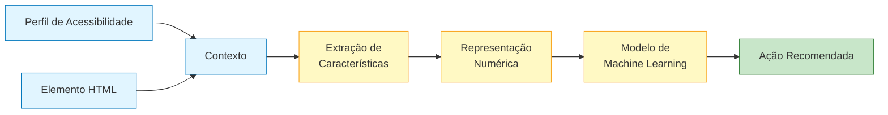
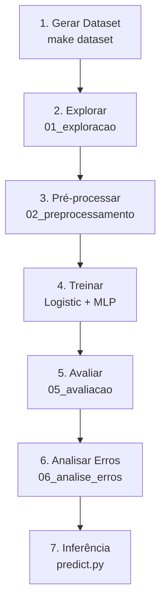
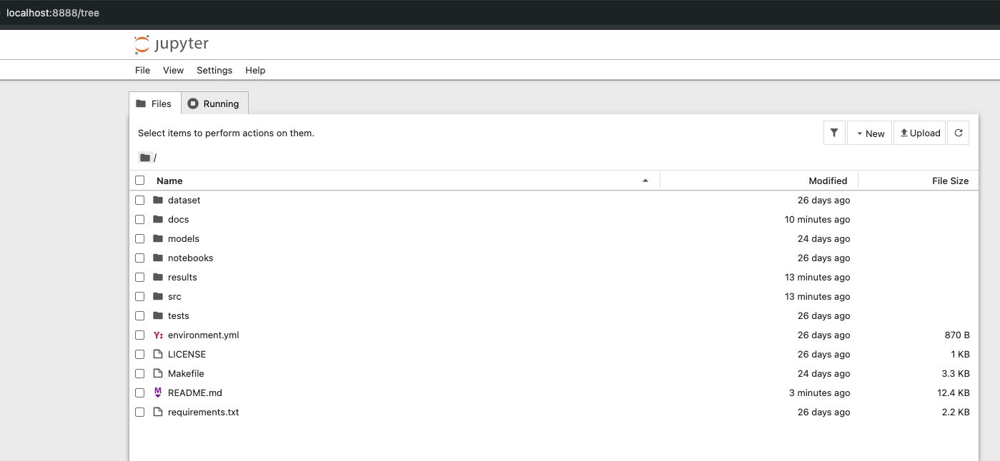

# Detecção Automática de Barreiras de Acessibilidade em Objetos de Aprendizagem Utilizando Deep Learning

> **Projeto Acadêmico de Mestrado e Disciplina de Deep Learning**
> Investigação experimental sobre recomendação automática de adaptações de acessibilidade em componentes HTML de Objetos de Aprendizagem (OA) utilizados no Moodle.

[](LICENSE)
[](https://www.python.org/downloads/)
[](https://github.com/psf/black)
[](https://github.com/unicsoftware/accessibility-dl-moodle/actions)

---

## 1. Introdução

A acessibilidade digital é um requisito essencial em Ambientes Virtuais de Aprendizagem (AVA) como o Moodle, pois garante o acesso equânime ao conhecimento para pessoas com deficiência. Este repositório contém o **laboratório computacional completo** para a pesquisa de mestrado intitulada *"Detecção Automática de Barreiras de Acessibilidade em Objetos de Aprendizagem Utilizando Deep Learning"*.

O projeto é um artefato **experimental de validação de hipótese** — não implementa o sistema de adaptação dinâmica do Moodle em produção. O objetivo é verificar se modelos supervisionados são capazes de **recomendar** adaptações de acessibilidade em componentes HTML de OAs a partir de um **perfil de acessibilidade do usuário** e de um **elemento HTML**.

---

## 2. Objetivo Científico

Investigar empiricamente se um modelo de aprendizado supervisionado (Regressão Logística e MLP) consegue inferir qual **ação de acessibilidade** deve ser recomendada (`ADD_ALT`, `ADD_ARIA`, `FIX_HEADING`, `NO_ACTION`) dado um par *(perfil do usuário, elemento HTML)*.

---

## 3. Motivação

* Crescimento de cursos EAD mediados por OAs no Moodle.
* Acessibilidade ainda é frequentemente tratada de forma reativa e manual.
* Dificuldade de professores em identificar barreiras em componentes HTML.
* Potencial de recomendação automática baseada em dados.

---

## 4. Questão de Pesquisa

> É possível treinar um modelo supervisionado para recomendar adaptações de acessibilidade em elementos HTML de Objetos de Aprendizagem do Moodle, considerando diferentes perfis de usuários?

---

## 5. Hipótese

> **H₁:** Dado um perfil de acessibilidade e um elemento HTML, um modelo supervisionado é capaz de predizer com acurácia significativamente superior ao acaso qual adaptação de acessibilidade deve ser aplicada.
>
> **H₀:** O modelo não apresenta desempenho superior ao classificador base (*majority class baseline*).

---

## 6. Arquitetura Conceitual



### Modelo Conceitual de Entrada → Saída

```
Entrada:
  Perfil de Acessibilidade (VISUAL | AUDITIVO | MOTOR | COGNITIVO)*
  + Elemento HTML

       ↓

  Feature Engineering:
    has_img, has_alt, has_aria, has_button, has_form, has_link,
    has_table, heading_count, invalid_heading, text_length, tag_count

       ↓

  Modelo Supervisionado:
    Logistic Regression  |  MLP (PyTorch)

       ↓

Saída:
  ADD_ALT  |  ADD_ARIA  |  FIX_HEADING  |  NO_ACTION
```

*Nesta versão apenas **VISUAL** é implementado. A arquitetura está preparada para os outros perfis.*

---

## 7. Estrutura do Repositório

```
accessibility-dl-moodle/
├── README.md                  ← Este arquivo
├── LICENSE                    ← Licença MIT
├── .gitignore
├── requirements.txt
├── environment.yml
├── Makefile
│
├── docs/                      ← Documentação científica
│   ├── arquitetura.md
│   ├── metodologia.md
│   ├── reproduzibilidade.md
│   ├── dataset.md
│   └── metricas.md
│
├── dataset/                   ← Massa de dados
│   ├── README.md
│   ├── raw/
│   │   └── accessibility_dataset.csv
│   ├── processed/
│   │   ├── train.csv
│   │   ├── validation.csv
│   │   └── test.csv
│   └── synthetic/
│       └── dataset_generator.py
│
├── notebooks/                 ← Notebooks didáticos
│   ├── 01_exploracao_dataset.ipynb
│   ├── 02_preprocessamento.ipynb
│   ├── 03_treinamento_regressao_logistica.ipynb
│   ├── 04_treinamento_mlp.ipynb
│   ├── 05_avaliacao_modelos.ipynb
│   └── 06_analise_erros.ipynb
│
├── src/                       ← Código-fonte
│   ├── config.py
│   ├── dataset/
│   │   ├── loader.py
│   │   ├── preprocessing.py
│   │   ├── feature_engineering.py
│   │   └── split.py
│   ├── models/
│   │   ├── logistic_regression.py
│   │   └── mlp.py
│   ├── training/
│   │   ├── train_logistic.py
│   │   └── train_mlp.py
│   ├── evaluation/
│   │   ├── metrics.py
│   │   ├── confusion_matrix.py
│   │   └── reports.py
│   ├── inference/
│   │   └── predict.py
│   └── utils/
│       ├── logger.py
│       ├── seed.py
│       └── export.py
│
├── models/                    ← Artefatos treinados
│   ├── logistic_model.pkl
│   └── mlp_model.pt
│
├── results/                   ← Saídas experimentais
│   ├── metrics.csv
│   ├── predictions.csv
│   ├── classification_report.txt
│   ├── confusion_matrix.png
│   └── learning_curve.png
│
├── tests/                     ← Testes unitários
│   ├── test_dataset.py
│   ├── test_preprocessing.py
│   └── test_models.py
│
└── .github/
    └── workflows/
        └── ci.yml
```

---

## 8. Fluxo Experimental



---

## 9. Instalação

### 9.1. Usando `pip`

```bash
# Clonar o repositório
git clone https://github.com/unicsoftware/accessibility-dl-moodle.git
cd accessibility-dl-moodle

# Criar ambiente virtual
python3 -m venv .venv
source .venv/bin/activate    # Linux/macOS
# .venv\Scripts\activate     # Windows

# Instalar dependências
pip install -r requirements.txt

# Registrar kernel Jupyter
python -m ipykernel install --user --name accessibility-dl-moodle
```

### 9.2. Usando `conda`

```bash
conda env create -f environment.yml
conda activate accessibility-dl-moodle
```

---

## 10. Como Gerar o Dataset

```bash
make dataset
```

ou diretamente (definindo PYTHONPATH):

```bash
PYTHONPATH=. python dataset/synthetic/dataset_generator.py \
    --output dataset/raw/accessibility_dataset.csv \
    --samples 20000
```

O gerador produz **20.000 registros balanceados** (5.000 por classe) com variações de imagens, links, listas, botões, inputs, cards, formulários, headings, tabelas, etc. Mais detalhes em [`docs/dataset.md`](docs/dataset.md) e [`dataset/README.md`](dataset/README.md).

---

## 11. Como Executar os Notebooks

```bash
# Iniciar servidor Jupyter
jupyter notebook
```



Em seguida navegue até `notebooks/` e execute na ordem:

1. `01_exploracao_dataset.ipynb` — análise exploratória
2. `02_preprocessamento.ipynb` — limpeza e divisão
3. `03_treinamento_regressao_logistica.ipynb` — baseline
4. `04_treinamento_mlp.ipynb` — rede neural
5. `05_avaliacao_modelos.ipynb` — comparação
6. `06_analise_erros.ipynb` — diagnóstico

Para executar todos automaticamente:

```bash
make notebooks
```

---

## 12. Como Treinar os Modelos

```bash
# Treinar ambos via Make
make train

# Ou individualmente (definindo PYTHONPATH)
PYTHONPATH=. python src/training/train_logistic.py --seed 42
PYTHONPATH=. python src/training/train_mlp.py --seed 42
```

Os artefatos são salvos em `models/`:

* `models/logistic_model.pkl`
* `models/mlp_model.pt`

---

## 13. Como Gerar Métricas

```bash
make evaluate
```

Gera em `results/`:

* `metrics.csv` — accuracy, precision, recall, f1
* `predictions.csv` — predições no conjunto de teste
* `classification_report.txt`
* `confusion_matrix.png`
* `learning_curve.png`

---

## 14. Como Reproduzir os Experimentos

```bash
# Pipeline completo: instalação → dataset → treino → avaliação
make all
```

Para resetar:

```bash
make clean
```

---

## 15. Como Realizar Inferências

```bash
# Via Make
make predict

# Ou diretamente (definindo PYTHONPATH)
PYTHONPATH=. python src/inference/predict.py \
    --html '' \
    --profile VISUAL
```

Saída esperada:

```text
HTML:    
Profile: VISUAL
Predicted Action: ADD_ALT
Confidence: 0.94
```

---

## 16. Como Adicionar Novas Classes

Para incluir uma nova classe (ex.: `ADD_CAPTION` para legendas em vídeos):

1. **Estender o gerador de dataset** em `dataset/synthetic/dataset_generator.py` adicionando templates que produzam HTML cuja ação rotulada seja `ADD_CAPTION`.
2. **Atualizar a lista de classes** em `src/config.py`:
   ```python
   ACTION_CLASSES = ["ADD_ALT", "ADD_ARIA", "FIX_HEADING", "NO_ACTION", "ADD_CAPTION"]
   ```
3. **Regenerar o dataset** com `make dataset`.
4. **Re-treinar** com `make train`.
5. **Re-avaliar** com `make evaluate`.

A arquitetura foi projetada para extensão — basta atualizar os pontos acima e o pipeline se adapta.

---

## 17. Como Contribuir

1. Fork o projeto.
2. Crie uma branch para sua feature (`git checkout -b feature/nova-classe`).
3. Commit suas mudanças (`git commit -m 'Adiciona classe ADD_CAPTION'`).
4. Push para a branch (`git push origin feature/nova-classe`).
5. Abra um Pull Request.

Padrões:

* Código formatado com `black` e `isort`
* Type hints obrigatórios
* Docstrings em português
* Testes para novos módulos

---

## 18. Resultados Esperados

Os modelos implementados servem como **baseline experimental**. Resultados quantitativos serão documentados após a execução do pipeline.

| Modelo | Accuracy | Precision (macro) | Recall (macro) | F1 (macro) |
|--------|----------|-------------------|----------------|------------|
| Logistic Regression | *a executar* | *a executar* | *a executar* | *a executar* |
| MLP (PyTorch) | *a executar* | *a executar* | *a executar* | *a executar* |

---

## 19. Limitações e Trabalhos Futuros

* Dataset é **sintético** — necessário validar com dados reais de OAs do Moodle.
* Apenas perfil **VISUAL** implementado — expansão para AUDITIVO, MOTOR, COGNITIVO é trabalho futuro.
* Não considera contexto semântico completo (apenas features estruturais do HTML).
* Análise linguística do conteúdo textual não é realizada.
* Próximas etapas: integração com parser real de OAs, validação com usuários finais, análise qualitativa com especialistas em acessibilidade.

---

## 20. Citação

```bibtex
@software{junior2026accessibility,
  author = {Junior, Elpidio},
  title  = {Detecção Automática de Barreiras de Acessibilidade em Objetos de Aprendizagem Utilizando Deep Learning},
  year   = {2026},
  url    = {https://github.com/unicsoftware/accessibility-dl-moodle}
}
```

---

## 21. Licença

Distribuído sob a licença MIT. Veja [`LICENSE`](LICENSE) para mais informações.

---

## 22. Contato

* **Autor:** Elpidio Junior
* **Projeto:** Mestrado — Acessibilidade em Objetos de Aprendizagem
* **Disciplina:** Deep Learning

---


Executar o pipeline completo por meio do Makefile:
make PYTHON=.venv/bin/python dataset (para gerar o dataset sintético de teste)
make PYTHON=.venv/bin/python train (para treinar os modelos de teste)
make PYTHON=.venv/bin/python evaluate (para gerar as métricas e gráficos)
make PYTHON=.venv/bin/python predict (para testar a inferência)
make PYTHON=.venv/bin/python notebooks (para rodar todos os notebooks em sequência)