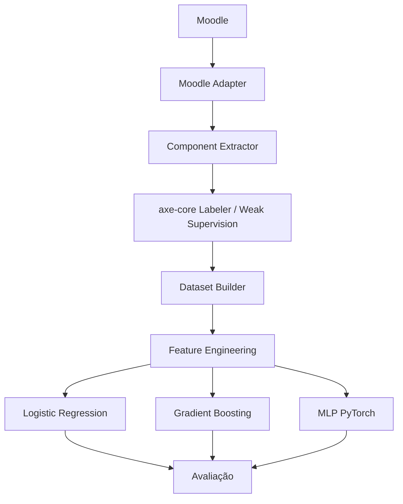

# Arquitetura do Sistema

## 1. Visão Geral

Este documento descreve a arquitetura do pipeline completo para geração de datasets de acessibilidade utilizando HTMLs reais do Moodle, *Weak Supervision* com **axe-core** e complementação por dados sintéticos.

A arquitetura é dividida em **8 camadas obrigatórias**:

---

## 2. Descrição das Camadas

### 2.1. Moodle
* **Responsabilidade:** Fonte dos Objetos de Aprendizagem (OAs).
* **Descrição:** Contém cursos, páginas, atividades (tarefas, fóruns, questionários) e recursos que alimentam a extração de dados.

### 2.2. Moodle Adapter
* **Responsabilidade:** Integração e extração remota/local do Moodle (`src/moodle/adapter.py`).
* **Descrição:** Realiza autenticação (tokens Web Service / sessão), navega pelos cursos e atividades, extrai o HTML completo das páginas e gera metadados de origem (`course_id`, `activity_id`, `url`, `timestamp`). Isola toda a lógica específica da plataforma.

### 2.3. Component Extractor
* **Responsabilidade:** Fragmentação automatizada de componentes (`src/extractor/component_extractor.py`).
* **Descrição:** Recebe o HTML extraído pelo Moodle Adapter e o divide em componentes HTML independentes. Identifica e isola elementos das tags:
  - `img`, `button`, `input`, `form`, `table`, `a`, `select`, `textarea`, `video`, `audio`, `figure`, `svg`, `canvas`.
  - Salva cada componente individualmente associado aos seus metadados de origem.

### 2.4. axe-core Labeler
* **Responsabilidade:** Rotulação automatizada via *Weak Supervision* (`src/labeler/axe_labeler.py` e `src/labeler/wcag_mapper.py`).
* **Descrição:** Executa o **axe-core** utilizando Playwright headless (ou analisador estático baseado em regras axe-core). Analisa cada componente HTML individualmente, gera um JSON contendo todas as violações detectadas, converte-as em critérios WCAG via `WCAGMapper` e produz rótulos multi-label para cada componente.

### 2.5. Dataset Builder
* **Responsabilidade:** Consolidação e exportação dos datasets (`src/dataset/builder.py`).
* **Descrição:** Consolida HTML, metadados, features e rótulos WCAG/ações. Suporta três modos de operação:
  - `REAL_ONLY`: Apenas componentes HTML reais extraídos do Moodle.
  - `SYNTHETIC_ONLY`: Apenas componentes sintéticos gerados por templates.
  - `HYBRID`: Combinação automática de dados reais e sintéticos.
  - Gera automaticamente: `accessibility_dataset.csv` e `accessibility_dataset.parquet`.

### 2.6. Feature Engineering
* **Responsabilidade:** Extração de vetores numéricos de características (`src/dataset/feature_engineering.py`).
* **Descrição:** Extrai **22 features estruturais** (preservando as 11 originais para compatibilidade e adicionando 11 novas features estruturais):
  - **Originais:** `has_img`, `has_alt`, `has_aria`, `has_button`, `has_form`, `has_link`, `has_table`, `heading_count`, `invalid_heading`, `text_length`, `tag_count`.
  - **Novas:** `has_select`, `has_textarea`, `has_video`, `has_audio`, `has_figure`, `has_svg`, `has_canvas`, `select_count`, `textarea_count`, `media_count`, `svg_canvas_count`.

### 2.7. Modelagem
* **Responsabilidade:** Treinamento dos modelos de aprendizado de máquina (`src/models/`).
* **Descrição:** Treina três famílias de modelos para permitir comparação experimental:
  - **Logistic Regression** (`src/models/logistic_regression.py`): Modelo linear baseline interpretável.
  - **Gradient Boosting** (`src/models/gradient_boosting.py`): Modelo de árvores impulsionadas por gradiente.
  - **MLP — Multi-Layer Perceptron** (`src/models/mlp.py`): Rede neural *feedforward* implementada em PyTorch.

### 2.8. Avaliação
* **Responsabilidade:** Métricas e relatórios comparativos (`src/evaluation/`).
* **Descrição:** Calcula Precision, Recall e F1-score globais e por critério WCAG individual. Compara os 3 modelos entre si e valida suas predições em relação às violações detectadas pelo axe-core.

---

## 3. Decisões Arquiteturais

1. **Estratégia de Weak Supervision:** Uso exclusivo do axe-core para anotação automatizada sem necessidade de anotação manual em larga escala.
2. **Backward Compatibility:** Preservação de todos os módulos pré-existentes (`dataset_generator.py`, pipelines de treino e métricas).
3. **Persistência Dupla (CSV/Parquet):** Garantia de fácil inspeção (CSV) e leitura de alta performance em larga escala (Parquet).
