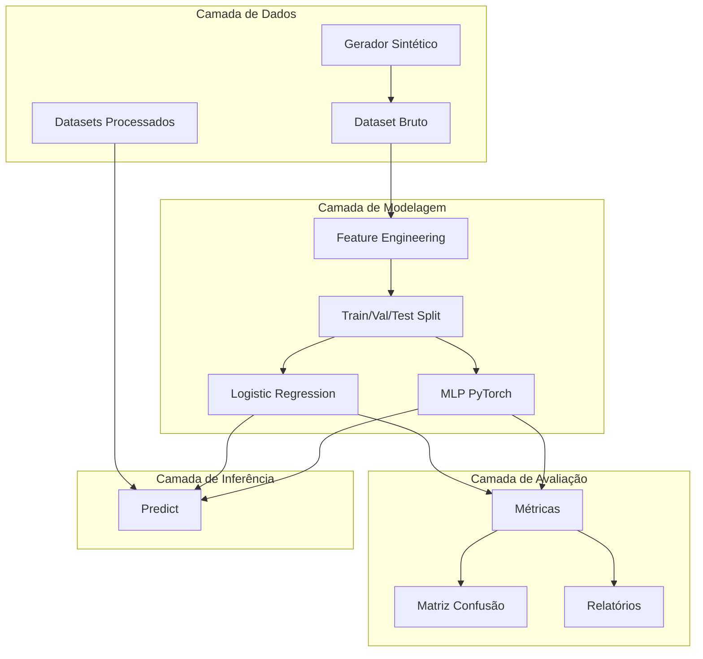

# Arquitetura do Sistema

## 1. Visão Geral

Este documento descreve a arquitetura técnica do laboratório experimental de recomendação de adaptações de acessibilidade em Objetos de Aprendizagem (OAs) do Moodle.

A arquitetura é organizada em **camadas** que separam responsabilidades e facilitam a evolução incremental do projeto.

## 2. Camada de Dados

### 2.1. Gerador Sintético

Responsável por produzir a massa de dados anotada. Implementa templates parametrizados que geram variações realistas de elementos HTML comumente encontrados em OAs do Moodle.

**Localização:** `dataset/synthetic/dataset_generator.py`

**Componentes:**

* **Templates de componentes:** imagens, botões, links, formulários, tabelas, headings, listas, cards.
* **Regras de rotulação:** cada template é mapeado a uma classe `action` (ADD_ALT, ADD_ARIA, FIX_HEADING, NO_ACTION).
* **Amostrador:** controla a quantidade de registros por classe (default 5.000 cada).

### 2.2. Dataset Bruto

CSV em `dataset/raw/accessibility_dataset.csv` com 20.000 registros e 14 colunas.

### 2.3. Datasets Processados

Dividisão estratificada em `dataset/processed/`:

* `train.csv` (70%)
* `validation.csv` (15%)
* `test.csv` (15%)

## 3. Camada de Modelagem

### 3.1. Feature Engineering

Extração de **11 features estruturais** do HTML:

| Feature | Tipo | Descrição |
|---------|------|-----------|
| `has_img` | binária | Presença de tag `` |
| `has_alt` | binária | Presença de atributo `alt` em imagens |
| `has_aria` | binária | Presença de atributos ARIA |
| `has_button` | binária | Presença de tag `<button>` |
| `has_form` | binária | Presença de tag `<form>` |
| `has_link` | binária | Presença de tag `<a>` |
| `has_table` | binária | Presença de tag `<table>` |
| `heading_count` | inteira | Número de tags `<h1>`–`<h6>` |
| `invalid_heading` | binária | Hierarquia inválida de headings |
| `text_length` | inteira | Comprimento do texto visível |
| `tag_count` | inteira | Quantidade total de tags |

**Localização:** `src/dataset/feature_engineering.py`

### 3.2. Modelos

Dois modelos supervisionados são treinados para permitir comparação experimental:

* **Logistic Regression** (`src/models/logistic_regression.py`): modelo linear de referência, usado como *baseline* interpretável.
* **MLP — Multi-Layer Perceptron** (`src/models/mlp.py`): rede neural *feedforward* implementada em PyTorch, com duas camadas ocultas.

## 4. Camada de Avaliação

* `src/evaluation/metrics.py` — accuracy, precision, recall, F1.
* `src/evaluation/confusion_matrix.py` — geração de heatmap.
* `src/evaluation/reports.py` — orquestrador que gera todos os artefatos em `results/`.

## 5. Camada de Inferência

* `src/inference/predict.py` — recebe HTML + perfil, extrai features, executa o modelo e retorna a ação recomendada com a confiança.

## 6. Decisões Arquiteturais

### 6.1. Por que apenas features estruturais?

A pesquisa foca em validação de hipótese. Features semânticas (BERT, embeddings) podem ser incorporadas em trabalhos futuros. Manter o modelo simples permite isolar a contribuição das features estruturais.

### 6.2. Por que MLP e não CNN/Transformer?

O problema é tabular: features são vetores numéricos de tamanho fixo. MLP é a arquitetura natural para esse cenário. Modelos mais complexos (transformers de HTML) ficam para evolução futura.

### 6.3. Por que seed fixa?

Reprodutibilidade. `src/utils/seed.py` força seeds em Python, NumPy e PyTorch.

## 7. Evolução Futura

| Fase | Incremento |
|------|-----------|
| 1 | Inclusão de perfis AUDITIVO, MOTOR, COGNITIVO |
| 2 | Embeddings semânticos (BERT, sentence-transformers) |
| 3 | Integração com parser real de OAs do Moodle |
| 4 | Validação com usuários reais |
| 5 | Estudo longitudinal em ambiente de produção |
