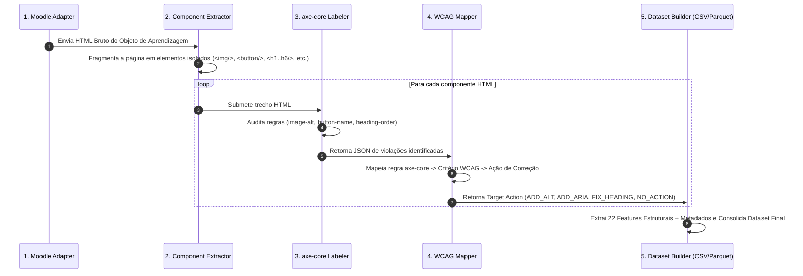

# Auditoria Automática e Weak Supervision com axe-core

Este documento detalha o papel do **axe-core** como motor de auditoria de acessibilidade no projeto, a origem das diretrizes WCAG 2.1 utilizadas, seu funcionamento no código e o roteiro para expansão de recursos e regras para múltiplos perfis de acessibilidade.

---

## 1. Origem e Fundamentação das Diretrizes

O **axe-core** é a engine de testes de acessibilidade desenvolvida e mantida pela **Deque Systems**, reconhecida mundialmente como padrão de mercado.

- **Norma Internacional:** Todas as regras do axe-core são rigorosamente fundamentadas na diretriz oficial **WCAG 2.1 (Web Content Accessibility Guidelines)** do **W3C (World Wide Web Consortium)**.
- **Papel no Projeto (*Weak Supervision*):** O axe-core substitui a necessidade de anotação manual custosa por especialistas humanos. Ele audita automaticamente os componentes HTML extraídos do Moodle e gera rótulos determinísticos de *Ground Truth*.

---

## 2. Atuação no Pipeline de 8 Camadas

No projeto, o axe-core atua na **Camada 4 (`src/labeler/`)**:



---

## 3. Mapeamento Determinístico (axe-core -> WCAG -> Ação Alvo)

O arquivo [`src/labeler/wcag_mapper.py`](file:///Users/elpidio.junior/Documents/_projetos/accessibility-dl-moodle/src/labeler/wcag_mapper.py) realiza a ponte entre as regras auditadas pelo axe-core, os critérios formais WCAG 2.1 e a classe de ação recomendada:

| Regra do axe-core | Critério WCAG Mapeado | Ação Alvo (*Target Action*) | Descrição da Violação |
| :--- | :--- | :--- | :--- |
| `image-alt`, `input-image-alt`, `area-alt` | **WCAG 1.1.1** (Conteúdo Não Textual) | **`ADD_ALT`** | Tag `` sem atributo `alt` ou texto alternativo |
| `button-name`, `label`, `aria-*`, `select-name` | **WCAG 4.1.2** (Nome, Função, Valor) | **`ADD_ARIA`** | Elemento interativo ou form sem rótulo/ARIA acessível |
| `heading-order`, `page-has-heading-one` | **WCAG 1.3.1** (Informações e Relações) | **`FIX_HEADING`** | Salto ou hierarquia incorreta de títulos (`<h1>` a `<h6>`) |
| `link-name` | **WCAG 2.4.4** (Propósito do Link) | **`ADD_ARIA`** | Link `<a>` sem texto visível ou atributo `aria-label` |
| *(Nenhuma violação)* | Conforme WCAG 2.1 | **`NO_ACTION`** | Componente em conformidade com as diretrizes |

---

## 4. Modos de Execução no Código

O módulo [`src/labeler/axe_labeler.py`](file:///Users/elpidio.junior/Documents/_projetos/accessibility-dl-moodle/src/labeler/axe_labeler.py) suporta duas estratégias complementares de auditoria:

1. **Injeção de Script JS com Playwright (`_run_axe_playwright`):**
   Executa um navegador Chromium Headless, renderiza o componente no DOM e injeta a auditoria de regras axe-core diretamente sobre a página.

2. **Analisador Heurístico Estático (`_run_axe_heuristic`):**
   Utiliza a biblioteca BeautifulSoup para realizar a inspeção estática determinística das regras do axe-core. É utilizado como fallback automático de alto desempenho ou em execuções offline.

---

## 5. Roteiro para Expansão e Enriquecimento de Features (Outros Perfis)

Para expandir a capacidade do pipeline para perfis de acessibilidade além do `VISUAL` (como **AUDITIVO**, **MOTOR** e **COGNITIVO**), o enriquecimento de características deve ser implementado no arquivo [`src/dataset/feature_engineering.py`](file:///Users/elpidio.junior/Documents/_projetos/accessibility-dl-moodle/src/dataset/feature_engineering.py):

```
                          Sinais Estruturais por Perfil
                                       │
     ┌──────────────────────┬──────────┴───────────┬──────────────────────┐
     ▼                      ▼                      ▼                      ▼
  VISUAL                AUDITIVO                 MOTOR                COGNITIVO
(Atuais - 22)        (Novas Features)       (Novas Features)       (Novas Features)
- has_img            - has_captions         - tabindex_invalid     - readability_score
- has_alt            - has_subtitles        - has_accesskey        - sentence_avg_len
- has_aria           - has_audio_transcript - target_size_small    - abbr_count
- heading_count      - media_duration       - has_keyboard_focus   - has_lang_attr
```

### A. Perfil AUDITIVO (WCAG 1.2 — Mídias em Tempo Real)
- **Regras axe-core associadas:** `video-caption`, `audio-caption`.
- **Critérios WCAG:** WCAG 1.2.1, WCAG 1.2.2.
- **Novas Features Estruturais a Adicionar:**
  - `has_captions` (0/1): Presença de `<track kind="captions">` dentro da tag `<video>`.
  - `has_subtitles` (0/1): Presença de legendas descritivas.
  - `has_audio_transcript` (0/1): Presença de link/bloco de transcrição associado a áudios.
- **Nova Ação Alvo:** `ADD_CAPTION`.

### B. Perfil MOTOR (WCAG 2.1 / 2.5 — Operável por Teclado e Alvos Touch)
- **Regras axe-core associadas:** `tabindex`, `target-size`, `focus-order-semantics`.
- **Critérios WCAG:** WCAG 2.1.1, WCAG 2.5.5.
- **Novas Features Estruturais a Adicionar:**
  - `tabindex_invalid` (0/1): Presença de `tabindex > 0` (quebra a ordem natural do foco).
  - `has_accesskey` (0/1): Presença de atalhos diretos de teclado (`accesskey`).
  - `target_size_small` (0/1): Elementos clicáveis com área menor que 44x44px.
  - `has_keyboard_focus` (0/1): Estilos visuais para estado de foco (`:focus`).
- **Nova Ação Alvo:** `FIX_KEYBOARD_NAV`.

### C. Perfil COGNITIVO (WCAG 3.1 — Compreensível e Legível)
- **Regras axe-core associadas:** `html-has-lang`, `valid-lang`.
- **Critérios WCAG:** WCAG 3.1.1, WCAG 3.1.5.
- **Novas Features Estruturais a Adicionar:**
  - `readability_score` (float): Índice de legibilidade da linguagem do texto (Flesch-Kincaid).
  - `sentence_avg_length` (float): Tamanho médio das sentenças textuais.
  - `abbr_count` (int): Contagem de siglas não explicadas por tags `<abbr>`.
  - `has_lang_attr` (0/1): Presença do atributo de idioma (`lang="pt-br"`).
- **Nova Ação Alvo:** `ADD_LANG`.

---

## 6. Passos para Ativação no Código

1. **Configuração (`src/config.py`):**
   ```python
   ACTIVE_PROFILES: list[str] = ["VISUAL", "AUDITIVO", "MOTOR", "COGNITIVO"]
   ```
2. **Atualização da Tabela no WCAG Mapper (`src/labeler/wcag_mapper.py`):**
   Registrar as novas chaves no dicionário `AXE_TO_WCAG` e em `AXE_TO_ACTION`.
3. **Re-treinamento:**
   Executar `make dataset` e `make train` para consolidar as novas colunas e treinar os modelos com o vetor expandido.
