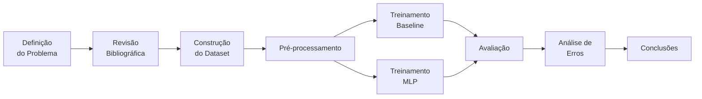

# Metodologia

## 1. Tipo de Pesquisa

Pesquisa **experimental quantitativa** com objetivo de validar hipótese supervisionada, no contexto de pesquisa em **Inteligência Artificial Aplicada à Acessibilidade Digital**.

## 2. Pipeline Metodológico

## 3. Definição do Problema

**Variável independente (entrada):**

* Perfil de acessibilidade do usuário (VISUAL)
* Elemento HTML (string bruta)

**Variável dependente (saída):**

* Classe de ação recomendada: ADD_ALT, ADD_ARIA, FIX_HEADING, NO_ACTION

## 4. Construção do Dataset

### 4.1. Estratégia

Devido à indisponibilidade de um dataset público anotado de OAs do Moodle com barreiras de acessibilidade rotuladas, optou-se por **geração sintética controlada** de 20.000 amostras balanceadas.

### 4.2. Templates

Cada classe é gerada a partir de **templates parametrizados**:

* **ADD_ALT** (~5.000): variações de `` sem `alt` em diferentes contextos.
* **ADD_ARIA** (~5.000): botões, links e inputs sem atributos ARIA.
* **FIX_HEADING** (~5.000): hierarquias de heading inválidas (ex.: `<h3>` seguido de `<h1>`).
* **NO_ACTION** (~5.000): elementos HTML já acessíveis (com `alt`, com `aria-label`, hierarquia correta).

### 4.3. Features Extraídas

Onze features são extraídas deterministicamente do HTML:

1. `has_img` — presença de ``
2. `has_alt` — presença de `alt` em imagens
3. `has_aria` — presença de `aria-*` em qualquer tag
4. `has_button` — presença de `<button>`
5. `has_form` — presença de `<form>`
6. `has_link` — presença de `<a>`
7. `has_table` — presença de `<table>`
8. `heading_count` — quantidade de `<h1>`–`<h6>`
9. `invalid_heading` — quebra de hierarquia
10. `text_length` — caracteres do texto visível
11. `tag_count` — total de tags

## 5. Divisão dos Dados

Partição **estratificada** para preservar a distribuição de classes:

| Split | Proporção | Tamanho aprox. |
|-------|-----------|----------------|
| Treino | 70% | 14.000 |
| Validação | 15% | 3.000 |
| Teste | 15% | 3.000 |

*Seed* fixa: 42 (configurável em `src/config.py`).

## 6. Modelos Treinados

### 6.1. Baseline: Regressão Logística

* Hiperparâmetros: `max_iter=1000`, `multi_class='multinomial'`.
* Justificativa: modelo linear, interpretável, baixo custo computacional, ideal como linha de base.

### 6.2. Modelo alvo: MLP

* Arquitetura: `Input(11) → Dense(64, ReLU) → Dropout(0.3) → Dense(32, ReLU) → Dropout(0.3) → Dense(4, Softmax)`.
* Otimizador: Adam (lr=1e-3).
* Loss: Cross-Entropy.
* Epochs: 100 com early stopping (paciência 10).
* Batch size: 64.

## 7. Avaliação

Métricas computadas no conjunto de teste:

* **Accuracy** global
* **Precision, Recall, F1** por classe e *macro avg*
* **Matriz de confusão** normalizada
* **Learning curves** (loss e accuracy por epoch)

Critérios de aceitação da hipótese:

* Accuracy superior ao *majority class baseline* (25% em dataset balanceado).
* F1-macro > 0.80 indica modelo de boa qualidade.

## 8. Análise de Erros

* Identificação das classes com maior confusão.
* Inspeção de falsos positivos e falsos negativos.
* Discussão sobre limitações das features estruturais.
* Sugestões para evolução do modelo.

## 9. Limitações Metodológicas

1. **Dataset sintético** — não captura a complexidade total de OAs reais.
2. **Perfil único** — apenas VISUAL foi implementado.
3. **Features estruturais** — não capturam semântica textual.
4. **Ausência de validação com usuários** — a pesquisa é pré-experimental.

## 10. Considerações Éticas

* Dados sintéticos — sem uso de dados pessoais.
* Pesquisa sem interação humana — não requer aprovação de comitê de ética nesta fase.
* Código aberto — replicabilidade plena.
