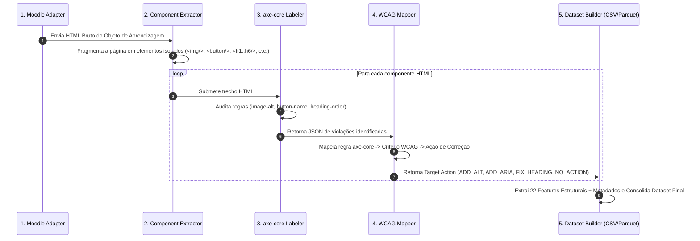

# Metodologia da Pesquisa

## 1. Abordagem Geral: Weak Supervision com axe-core

A pesquisa adota uma abordagem de **Supervisão Fraca (*Weak Supervision*)** para a recomendação automatizada de adaptações de acessibilidade em Objetos de Aprendizagem (OAs) do Moodle.

Em vez de depender de anotação manual custosa e suscetível a falhas humanas, utiliza-se o motor de auditoria **axe-core** (desenvolvido pela Deque Systems) para inspecionar componentes HTML e gerar rótulos automáticos com base nos critérios internacionais **WCAG 2.1**.

---

## 2. Fluxo de Processamento e Rotulação Automática

---

## 3. Mapeamento axe-core -> WCAG -> Ação Recomendada

| Regra do axe-core | Critério WCAG Associado | Ação Alvo (*Target Action*) | Descrição da Necessidade |
| :--- | :--- | :--- | :--- |
| `image-alt`, `area-alt` | **WCAG 1.1.1** (Conteúdo Não Textual) | **`ADD_ALT`** | Inclusão de texto alternativo descritivo na imagem |
| `button-name`, `label`, `select-name` | **WCAG 4.1.2** (Nome, Função, Valor) | **`ADD_ARIA`** | Inclusão de rótulo acessível via atributos `aria-label` ou `<label>` |
| `heading-order`, `empty-heading` | **WCAG 1.3.1** (Informações e Relações) | **`FIX_HEADING`** | Ajuste na hierarquia sequencial de títulos (`<h1>` a `<h6>`) |
| *(Nenhuma violação)* | Conforme WCAG 2.1 | **`NO_ACTION`** | Componente em conformidade com as diretrizes |

---

## 4. Etapas Sequenciais do Pipeline

1. **Extração de OAs (Moodle Adapter):** Autenticação e raspagem/consumo de APIs do Moodle para obter o HTML das páginas e atividades.
2. **Fragmentação (Component Extractor):** Decomposição automática da página em elementos HTML independentes.
3. **Rotulação Fraca (axe-core Labeler):** Auditoria automatizada de acessibilidade de cada componente gerando violações axe-core e o mapeamento para critérios WCAG.
4. **Consolidação (Dataset Builder):** Integração dos dados nos modos `REAL_ONLY`, `SYNTHETIC_ONLY` ou `HYBRID`.
5. **Feature Engineering:** Cálculo de 22 características estruturais determinísticas.
6. **Modelagem:** Treinamento e avaliação comparativa de Regressão Logística, Gradient Boosting e MLP (PyTorch).
7. **Avaliação:** Cálculo de métricas gerais e por critério WCAG, comparando o desempenho dos modelos e sua concordância com o axe-core.
