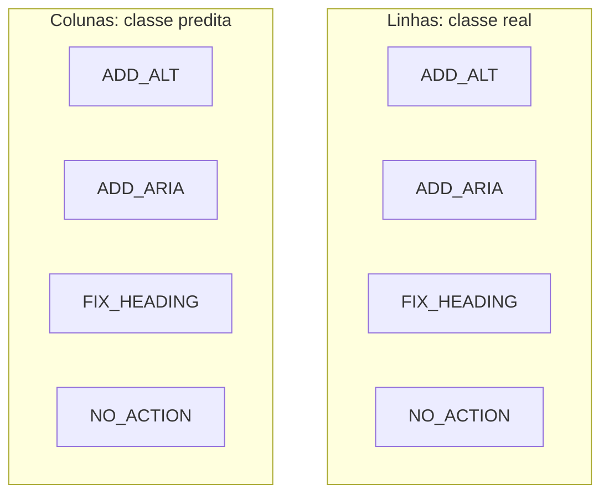

# Métricas de Avaliação

## 1. Métricas Computadas

| Métrica | Fórmula | Interpretação |
|---------|---------|---------------|
| Accuracy | (TP + TN) / Total | Proporção de acertos globais |
| Precision (macro) | média da precision por classe | Evidência de falsos positivos |
| Recall (macro) | média do recall por classe | Cobertura das classes |
| F1-Score (macro) | 2·P·R / (P + R) | Equilíbrio entre P e R |
| Matriz de confusão | tabela NxN | Onde o modelo erra |

## 2. Por que macro avg?

Dataset balanceado → *macro avg* trata todas as classes igualmente, fornecendo uma visão robusta do desempenho geral.

Em datasets desbalanceados (futuros cenários reais), recomenda-se também o *weighted avg*.

## 3. Critérios de Aceitação

| Cenário | F1-macro | Interpretação |
|---------|----------|---------------|
| Majority baseline | 0.25 | Modelo ingênuo (classe mais frequente) |
| Modelo fraco | 0.50–0.70 | Aprende parcialmente |
| Modelo aceitável | 0.70–0.85 | Bom equilíbrio |
| Modelo forte | 0.85–0.95 | Forte discriminação |
| Modelo excelente | > 0.95 | Risco de *overfitting* |

**Critério adotado:** F1-macro ≥ 0.80 indica hipótese validada.

## 4. Artefatos Gerados

Após `make evaluate`, são criados em `results/`:

* `metrics.csv` — tabela com accuracy, precision, recall, f1 para cada modelo.
* `predictions.csv` — predições individuais no conjunto de teste.
* `classification_report.txt` — relatório *sklearn* formatado.
* `confusion_matrix.png` — heatmap da matriz de confusão.
* `learning_curve.png` — curvas de loss/accuracy durante o treinamento.

## 5. Estrutura de `metrics.csv`

```csv
model,accuracy,precision_macro,recall_macro,f1_macro,f1_weighted
logistic_regression,0.85,0.85,0.85,0.85,0.85
mlp,0.91,0.91,0.91,0.91,0.91
```

## 6. Interpretação da Matriz de Confusão



* **Diagonal** = acertos.
* **Fora da diagonal** = confusões.
* Cores mais escuras = maior contagem.

## 7. Análise de Erros

No notebook `06_analise_erros.ipynb`:

* Top-K erros por classe.
* Exemplos de HTMLs mal classificados.
* Discussão qualitativa de padrões.
* Sugestões de features adicionais.

## 8. Testes Estatísticos (futuro)

Para validar significância da diferença entre modelos:

* **McNemar's test** — compara acertos/erros pareados.
* **Paired t-test** — em validação cruzada.
* **Wilcoxon signed-rank** — não paramétrico.

Implementação prevista em `src/evaluation/statistical_tests.py`.

## 9. Reporting Padronizado

Cada execução do pipeline gera:

* `results/metrics.csv` (tabular)
* `results/classification_report.txt` (texto)
* `results/confusion_matrix_<modelo>.png` (gráfico)
* `results/learning_curve_<modelo>.png` (gráfico)
* `results/metadata.json` (configuração, seed, timestamp)
